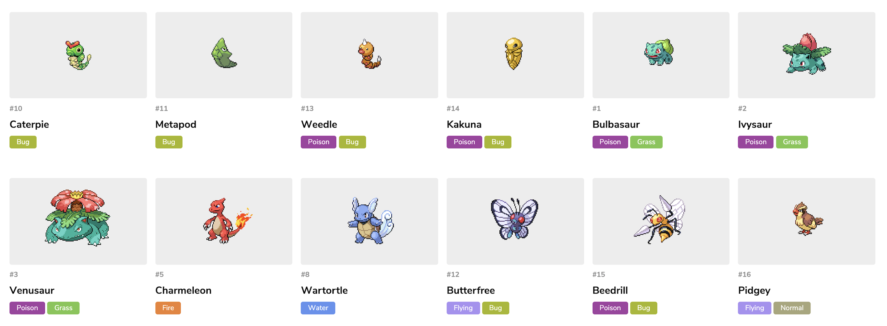

<h1 align="center">Web App From Scratch @cmda-minor-web 18-19</h1>

<p align="center"><b>A Pokédex that shows all the Pokemons. It currently displays these properties: image, id, name type(s), weight, height and game-stats. The data is retrieved using the <a href="https://pokeapi.co/">PokéAPI</a>.</b></p>

<p align="center">
  <a href="https://mennauu.github.io/web-app-from-scratch-18-19/week1">
    
  </a>
  <a href="https://mennauu.github.io/web-app-from-scratch-18-19/week2">
    
  </a>
  <a href="https://mennauu.github.io/web-app-from-scratch-18-19/week3">
    
  </a>
  <a href="https://github.com/Mennauu/web-app-from-scratch-18-19/blob/master/LICENSE">
    
  </a>
</p>



<!-- ☝️ replace this description with a description of your own work -->
## Introduction
This Pokédex is made as part of a course from [@cmda-minor-web 18-19](https://github.com/cmda-minor-web/web-app-from-scratch-1819). In this course I had to make a Web App without any framework or unnecessary libraries. The idea was to write as much Vanilla HTML, CSS and JavaScript as possible. The end product is a modular prototype for a single page Web App where data is retrieved from an external API.

<!-- Maybe a table of contents here? 📚 -->
## Table of Contents

- [Installation](#installation)
- [Features](#interaction)
- [Data](#data)
  - [Retrieve](#retrieve)
- [Checklist](#checklist)
- [Credits](#credits)
- [Sources](#sources)
- [License](#license)

<!-- How about a section that describes how to install this project? 🤓 -->
## Installation
1. Open your terminal
2. Change the directory to a folder in which you want to place the files
```bash
cd /~path
```
3. Clone the repository (you're going to need [Git](https://www.linode.com/docs/development/version-control/how-to-install-git-on-linux-mac-and-windows/))
```bash
git clone https://github.com/Mennauu/web-app-from-scratch-18-19
```
4. Load any live server and serve index.html

<!-- ...but how does one use this project? What are its features 🤔 -->
## Features

<!-- What external data source is featured in your project and what are its properties 🌠 -->
## Data
All the data used to create the Pokédex is taken from the [PokéAPI](pokeapi.co), which you can find at pokeapi.co. It serves over 17,000,000 API calls each month. It features almost all of the Pokémon data in one place.

### Retrieve
In the code beneath the **async / await** method is used with a custom errorHandling function (so we don't have to use a try and catch block) to retrieve data from the PokeAPI asynchronous. The data gets fetched from the API and is converted to JSON.

```Javascript
const getPokemonURL = async () => {
  const [err, data]  = await errorHandling((await fetch('https://pokeapi.co/api/v2/pokemon/?limit=20')).json())
  if(!data) throw err
  
  return data.results
}
```

### Featured data
The Pokédex features these properties taken from the API:
- **url:** Used to obtain data from a single pokemon
- **image:** Sprite of pokemon
- **id:** Unique id of pokemon
- **name:** Name of pokemon
- **type(s):** Each pokemon has one or two types, for example: flying and fire
- **weight:** Weight of pokemon in kilograms
- **height:** Height of pokemon in meters
- **game-stats:** Pokemons have base stats in games; speed, attack, special-attack, defense, special-defense and hp

<!-- Maybe a checklist of done stuff and stuff still on your wishlist? ✅ -->
## Checklist
- [x] Find an API of interest
- [x] Retrieve data from the API asynchronous
- [x] Render data to HTML without using innerHTML
- [X] Rewrite 'spaghetti' code to functions
- [X] Create a detailpage using a [router](http://projects.jga.me/routie/))
- [X] Style everything and make it responsive
- [X] Divide the functions into modules
- [ ] Add a filter function
- [ ] Add a sort function
- [ ] Keep data available in a variable (or use LocalStorage)
- [X] Write a README

<!-- Maybe someone helped me 🤔-->
## Credits
**Arash**: For helping me with error handling and great feedback and advice.

<!-- Maybe I used some awesome sources that I can mention 🤔-->
## Sources

### API
- [PokéAPI](https://pokeapi.co/)
- [PokéAPI documentation](https://pokeapi.co/docs/v2.html)

### Router
- [Routie](http://projects.jga.me/routie/)

### Async and await
- [Why await beats Promise#then()](https://mathiasbynens.be/notes/async-stack-traces)
- [The Async Await Episode I Promised](https://www.youtube.com/watch?v=vn3tm0quoqE)
- [Alternative error handling for async and await](https://stackoverflow.com/a/49311904 )

### General JavaScript
- [JavaScript Pro Tips - Code This, NOT That](https://www.youtube.com/watch?v=Mus_vwhTCq0)

<!-- How about a license here? 📜 (or is it a licence?) 🤷 -->
## License 
See the LICENSE file for license rights and limitations (MIT).