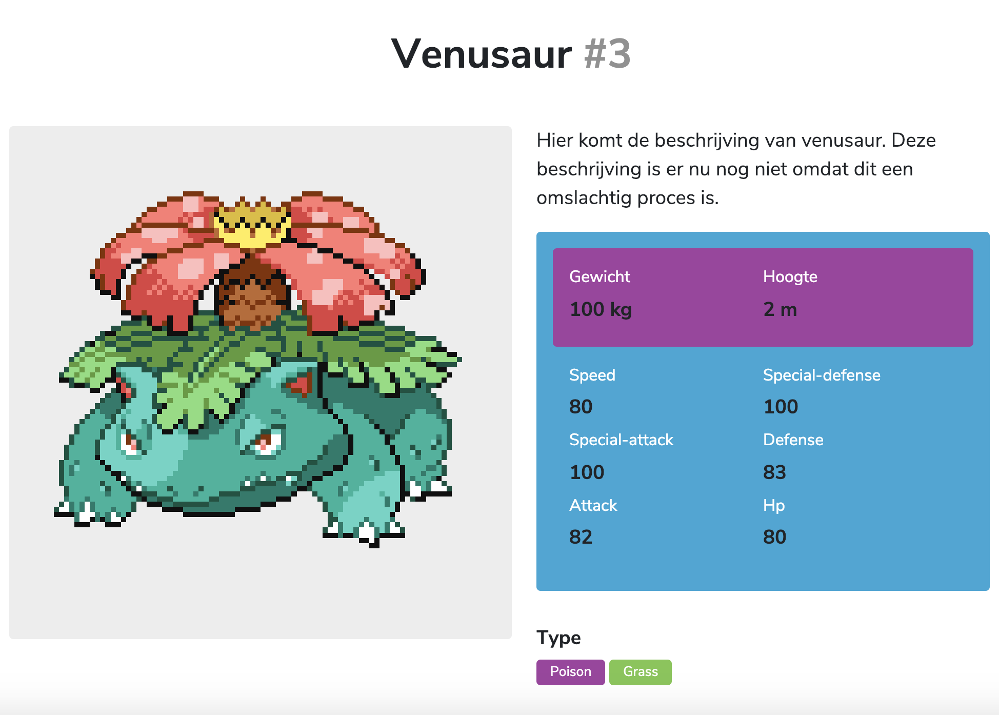

# Week 2 - Design and Refactor 🛠

Doel: Breakdown maken van de web app. Routes en states toevoegen. Detailpagina renderen.

<!-- Add a link to your live demo in Github Pages 🌐-->
[Live link](https://mennauu.github.io/web-app-from-scratch-18-19/week2)
<!-- Add a nice image here at the end of the week, showing off your shiny frontend 📸 -->

[Opdrachten](https://drive.google.com/open?id=1GMDTdW3LycAYpZSFI6gk_lrKrx8-zLWrNh69aaVEH5Y)

[Slides](https://drive.google.com/open?id=1IqQeu1m0dQiSC_KCvrn8eencAgtYe7X6qT-gm0n9Bmc)
