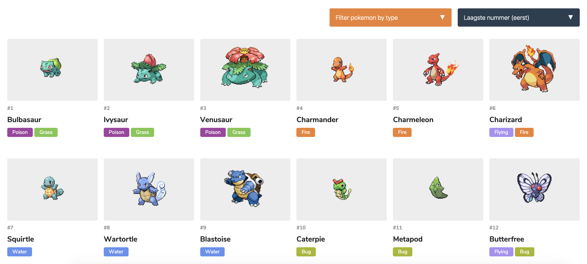

# Week 3 - Wrapping up 🎁

Doel: Data manipuleren. Code splitsen in modules. Reflecteren op eindresultaat.

<!-- Add a link to your live demo in Github Pages 🌐-->
[Live link](https://mennauu.github.io/web-app-from-scratch-18-19/week3)
<!-- Add a nice image here at the end of the week, showing off your shiny frontend 📸 -->

[Opdrachten](https://drive.google.com/open?id=13pKQu72pshaEzKw9q5JHLa-aop85nMP6nDCdqioWjoQ)

[Slides](https://drive.google.com/open?id=1BSzGYNLMgtHD4HRnK7f0DgyTv4Pg3xsQwD_eYNo7v0Y)
